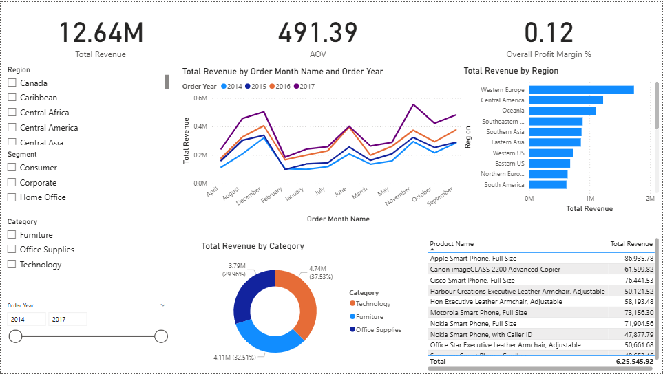
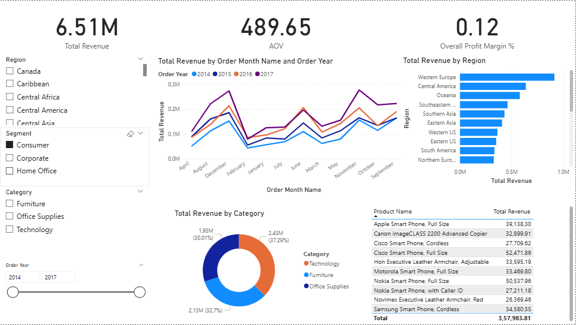

# 📊 Sales Performance & Customer Insights Dashboard

## 🔍 Project Overview
This project is an end-to-end sales analytics solution built to analyze revenue trends, customer behavior, product performance, and regional sales. The goal is to transform raw retail sales data into actionable business insights using Python, SQL, MySQL, and Power BI.

---

## 🛠 Tools & Technologies
- **Python** (Pandas, NumPy) – Data cleaning & feature engineering  
- **MySQL** – Data storage & querying  
- **SQL** – KPI and analytical queries  
- **Power BI** – Interactive dashboard & visualization  
- **Git & GitHub** – Version control and documentation  

---

## 📂 Dataset
- Global Superstore Dataset (Retail sales data)
- Records: **50,000+**
- Key fields: Orders, Customers, Products, Regions, Sales, Profit, Dates

---

## 📈 Key KPIs
- **Total Revenue**
- **Average Order Value (AOV)**
- **Overall Profit Margin**
- **Monthly Sales Trend**

---

## 📊 Dashboard Features
- KPI cards for executive-level overview  
- Monthly sales trend analysis  
- Revenue breakdown by region and product category  
- Top-performing products analysis  
- Interactive slicers for:
  - Order Year
  - Region
  - Category
  - Customer Segment  

---

## 🔍 Key Business Insights
- Identified seasonal sales patterns supporting demand forecasting and inventory planning  
- Found that a small number of regions and products contribute the majority of revenue  
- Observed that high-revenue categories do not always yield high profit margins  
- Highlighted opportunities to improve Average Order Value through bundling and upselling  
- Revealed potential business risk due to over-dependence on top-selling products  

---

## 🖼 Power BI Dashboard Preview

### 🔹 Overall Dashboard View

### 🔹 Filtered View (Interactive Analysis)

---

## 🚀 Outcome
The dashboard enables stakeholders to:
- Monitor overall sales performance
- Identify growth and underperforming areas
- Optimize pricing, inventory, and regional strategies
- Make data-driven business decisions

---

## 📌 Resume Highlight
**Built an end-to-end sales analytics solution using Python, SQL, MySQL, and Power BI on 50,000+ records, delivering actionable insights on revenue trends, product performance, and customer behavior through an interactive dashboard.**
